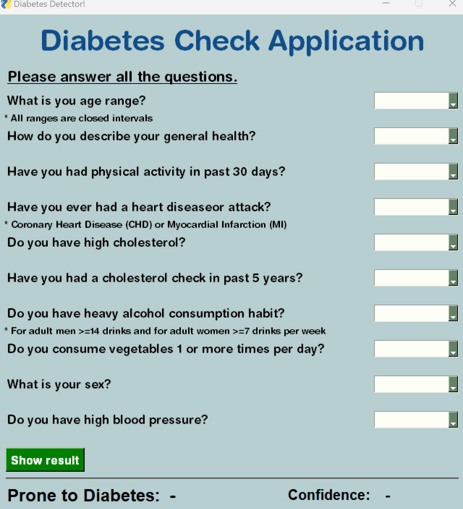
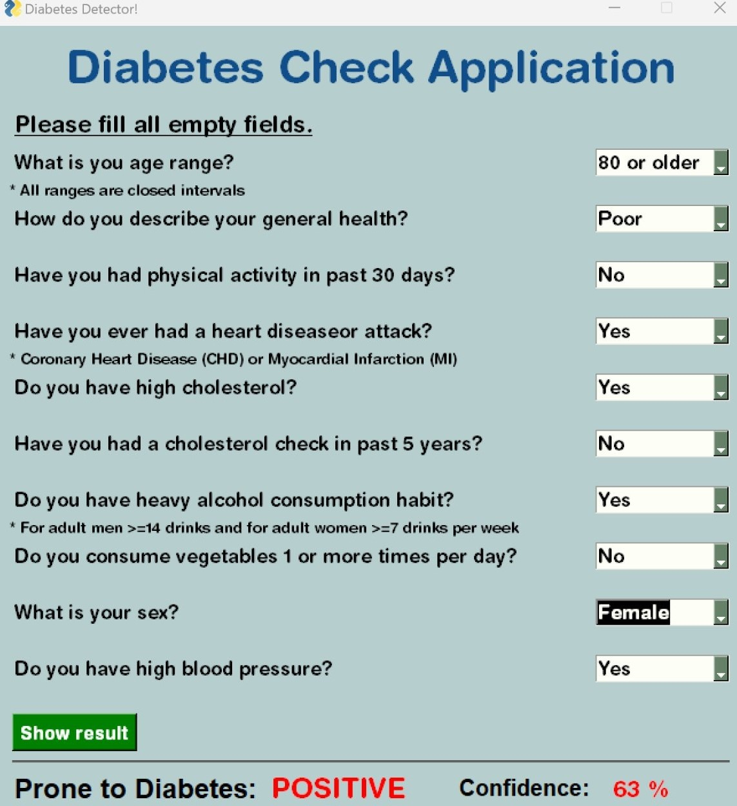

#  Diabetes Predictors 
Machine Learning model for predicting diabetes based on personal and health-related features. 

## Demo
Here is a sample of using our model: 
 

## Project Structure

The project is structured as follows:

## Getting Started
To get started with this project, please follow these steps:

-
-
-

## Implemented Models:
we have implemented the following models on our dataset:

- LSTM
- Linear Regression
- Random Forest
- TODO: complete it

After evaluation, we found out that the Random Forest model outperforms the other models and we use this model for our prediction system.

## Results 
| Model | Accuracy on test set |
|----------|------------|
|  LSTM  |    |
| Linear Regression   |    |
| Random Forest  |    |
TODO:

### Development
Want to contribute? Great!

To fix a bug or enhance an existing module, follow these steps:

- Fork the repo
- Create a new branch (`git checkout -b improve-feature`)
- Make the appropriate changes in the files
- Add changes to reflect the changes made
- Commit your changes (`git commit -am 'Improve feature'`)
- Push to the branch (`git push origin improve-feature`)
- Create a Pull Request 

## Team

 |  | |
---|---|---|---
[Ali Mehrabani](https://github.com/AliMehrabani) |[Amirreza Bagheri](https://github.com/AmBadAl) |[Amirhossein Nedaeipour](https://github.com/nedaei79)|[Paniz Halvachi](https://github.com/panizhalvachi)

Thanks DALL·E for generating the above picture profiles!

## License
MIT

